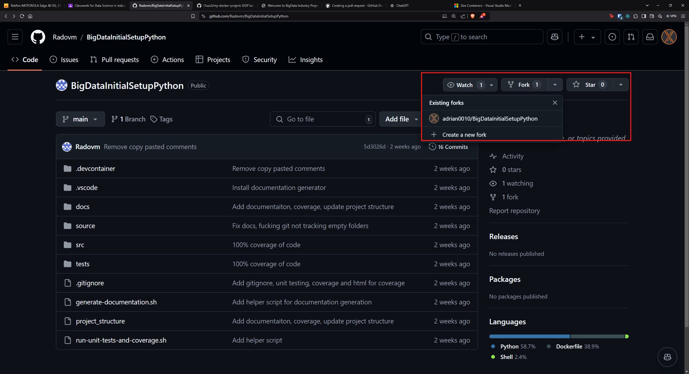
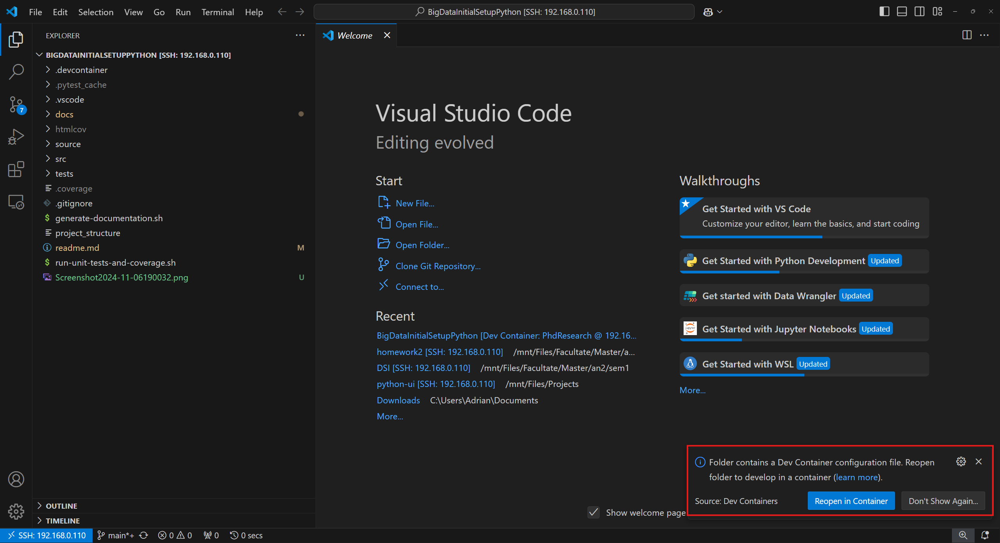
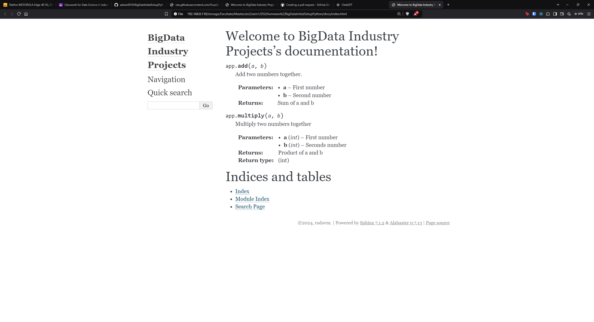
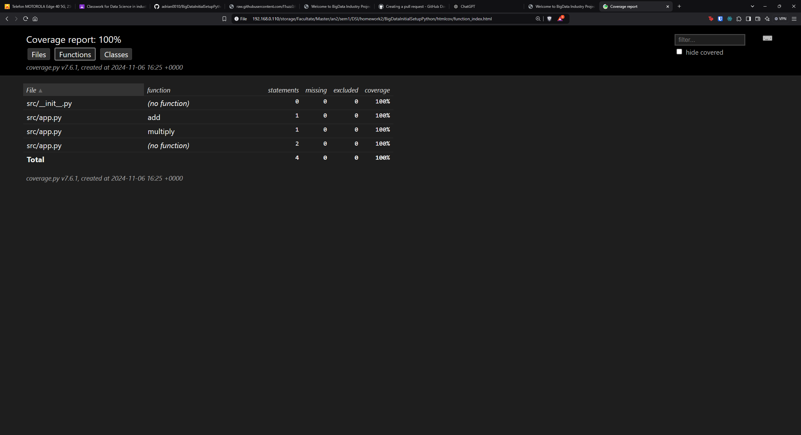

# Project Setup Documentation

## Prerequisites

To get the project up and running, I went through the following steps to set up the necessary tools. Make sure you have the following software installed on your machine:

1. **Docker**  
   To containerize and run the project, I used Docker. Here’s how I set it up:
   - I went to the [Docker website](https://www.docker.com/get-started) and downloaded Docker Desktop for my OS (I use Linux).
   - I followed the installation instructions provided on the site.

2. **Visual Studio Code**  
   For managing and editing the project code, I chose Visual Studio Code.
   - I downloaded VSCode from the [Visual Studio Code website](https://code.visualstudio.com/).

3. **VSCode Remote - Containers Extension**  
   I added this extension to open and work with Docker containers directly in VSCode. Here’s how to install it:
   - Open VSCode.
   - Go to the Extensions view by clicking on the Extensions icon
   - In the search bar, type "Dev Containers" and select the extension from Microsoft.
   - Click **Install** and wait for the installation to complete.

4. **Git**  
   Git is needed for version control and to clone the project repository.


## Step 1: Fork and Clone the Repository

### Fork the Repository

To work on this project, I started by creating a fork of the repository:

1. I went to the main repository page on GitHub.
2. In the top-right corner, I clicked the **Fork** button to create my own copy of the repository.

   


### Clone the Forked Repository

After forking, I moved on to cloning my forked repository:

1. I clicked the **Code** button on my forked repository page and copied the HTTPS URL.
2. Opened a terminal and navigated to the directory where I wanted to keep the project files.
3. Ran the following command, pasting in the URL I copied:
   ```bash
   git clone https://github.com/adrian0010/BigDataInitialSetupPython
   ```

## Step 2: Open the Project in VSCode and Run the Container

Once I had the project cloned, the next step was to open it in VSCode and set up the container environment.

### Opening the Project in VSCode

1. I opened **Visual Studio Code**.
2. In VSCode, I went to **File > Open Folder** 
3. Navigated to the cloned project folder and selected it.


### Running the Project in a Container

To run the project within a Docker container, I followed these steps:

1. When I opened the project, a **"Reopen in Container"** button appeared in the bottom-right corner of VSCode.


2. I clicked on this **"Reopen in Container"** button, and VSCode started building and setting up the Docker container based on the configuration in the `.devcontainer` folder.
   
   - The first build took a few minutes as VSCode downloaded dependencies and configured the container.
   
3. Once the container finished setting up, the terminal in VSCode opened within the container environment, ready to accept commands.


### Step 3: Run the scripts

After the container was set up and running, the next step I took was to run the scripts for documentation and tests.

#### Running the `generate-documentation.sh` Script

1. Inside the VSCode terminal, I ran the following command:
   ```bash
   ./generate-documentation.sh
   ```



#### Running the `run-unit-tests-and-coverage.sh` Script

2. In the VSCode terminal, I ran the following command to execute the unit tests and check the coverage:
   ```bash
   ./run-unit-tests-and-coverage.sh
   ```

